<a href="https://yowoapple.github.io/YoWoRingo/">
  
</a>

<p align="center">
  <a href="README.md">English</a> &nbsp;·&nbsp; <a href="README.zh-TW.md">繁體中文</a> &nbsp;·&nbsp; <b>简体中文</b> &nbsp;·&nbsp; <a href="README.ja.md">日本語</a>
</p>

<p align="center">
  <a href="https://yowoapple.github.io/YoWoRingo/"><b>yowoapple.github.io/YoWoRingo</b></a>
</p>

---

# YoWoRingo

YoWoRingo（曾博文）的个人作品集，地牛记录小组 TWERG 创始人、游戏开发者、街头摄影师，来自台湾新北。

这不是一个套上模板、改个名字就上线的网站，每一个板块都是一段独立打磨的交互设计，全部用原生 JavaScript 和 CSS 手写完成：由像素拼成的证件照、可以拎起来随手一扔的名字、在浏览器里实时生成的背景音乐，以及一个靠滚动来“变焦”的摄影展。

<br>

## 设计理念

### 颜色，只在有事发生时出现

整站只用三种颜色，近乎纯黑的 `#0B0B0C`、带纸张质感的白 `#EFEEEA`，以及克制的灰 `#85847F`，唯一打破这份安静的，是群青蓝 `#2B3BFF`。

它从不承担装饰作用，只在“有事件发生”时登场，比如鼠标悬停、页面转场、正在播放的音乐、当前阅读的板块、刚被键盘选中的按钮，所以看到蓝色，就说明此刻有事正在发生。

### 文字即界面

这里的文字不只会淡入淡出，它会被打散、重组、被抛来抛去，名字被写成一道等式，向下滚动，天数会从 Day 001 一路跳到 Day 100，标题使用超大字号，严格对齐网格，四周留足呼吸感。

这套思路借鉴了韩国设计工作室的作品，比如 [RAYRAYlab](https://rayraylab.com)、[Plus X](https://15th.plus-ex.com)、[DOES](https://does.kr)，黑白单色、放大到极致的字体、精准的排版，以及对色彩的高度克制。

### 最正式的照片，放在最不正式的地方

打开网站，迎面就是一张正式到略显拘谨的证件照，这是有意为之，因为网站的其余部分完全不是这种风格，这种反差正是看点：鼠标划过，脸会碎成像素，向下滚动，整张照片四散飞开，再重新拼成名字。

<p align="center">
  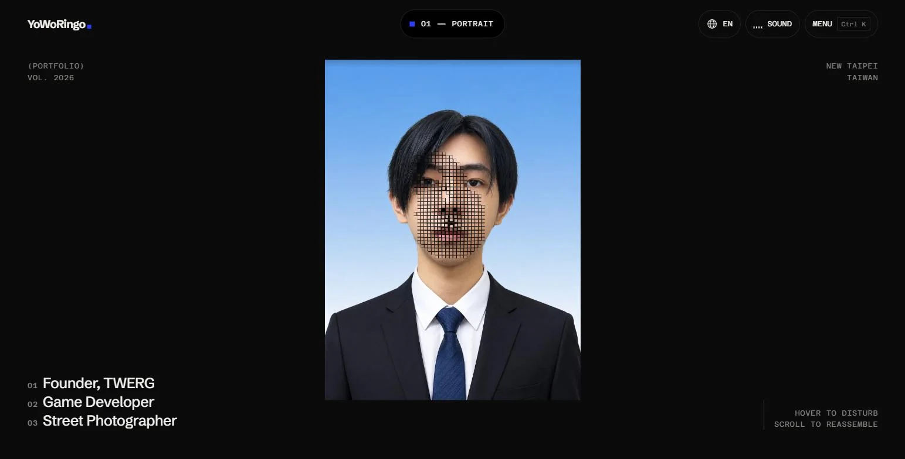
  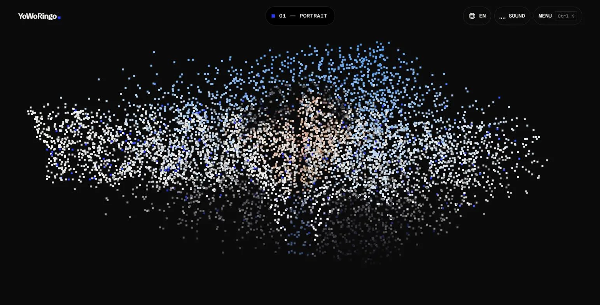
</p>
<p align="center">
  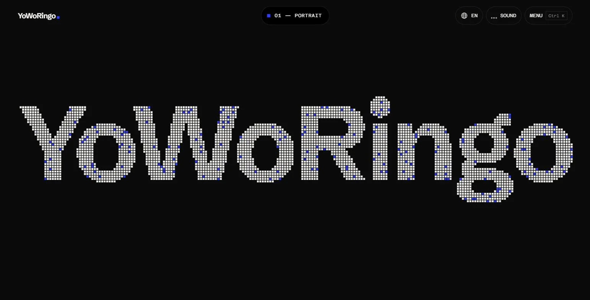
</p>

### 有声音，但先征得你的同意

让网站“活起来”的，不只有动效，还有声音，每一次点击、快门、碰撞都配有专属音效，还有一首背景音乐。

但在你于入口选择“Enter with sound”之前，网站不会发出任何声音，而且整站不加载任何音频文件，所有声音都由 Web Audio API 实时合成。

### 真实，也是设计的一部分

作品页只讲做了什么、为什么这么做，不夸大，也不藏着，地震回放中，除了方法奏效的那一次，另外两次效果反而变差的结果也原样保留，因为只展示成功案例的作品集，很难真正让人信服。

<br>

## 亮点一览

### 从像素到人（Pixel to Person）

用 Canvas 2D 绘制的证件照，由一个个从照片取色的方块组成，方块通过弹簧物理响应鼠标，向下滚动时再各自飞向新位置，拼出名字，在窄屏或性能较弱的设备上，方块会自动变粗，保证画面流畅。

### 物理游乐场（Playground）

名字里的每个字母、故事中的关键词、四张作品卡片，都是真正有质量的刚体（Matter.js），可以拎起来、扔出去，也可以点 Shake 把整箱摇乱，点击作品卡片即可进入对应作品，在手机上，倾斜手机就能改变重力方向（iOS 会先请求授权），而且只有滚动到这一板块时才会开始运算。

<p align="center">
  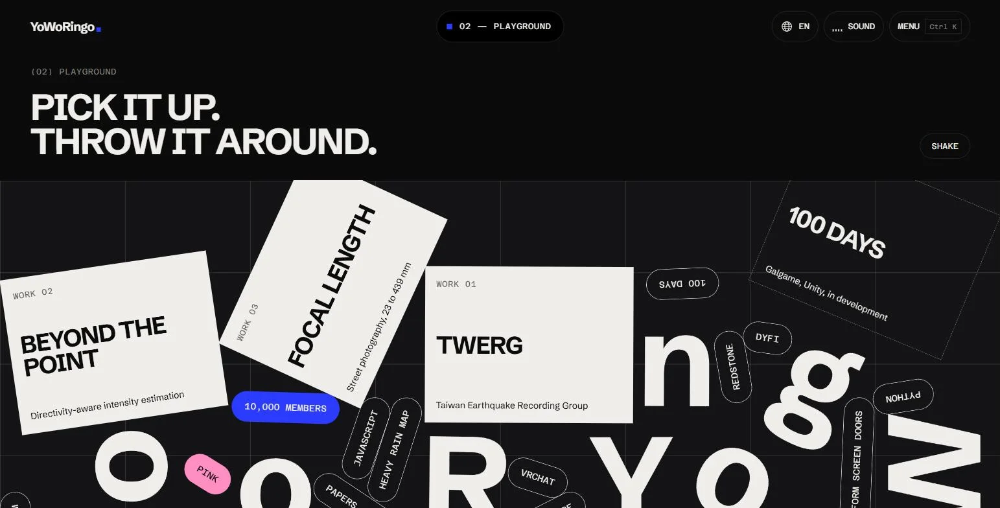
</p>

### 把名字写成一道等式

YoWo（有无）加上 Ringo（りんご，日语里的苹果），等于“Got any Ringo?”，也就是有没有苹果？一个本身就在提问的名字。

<p align="center">
  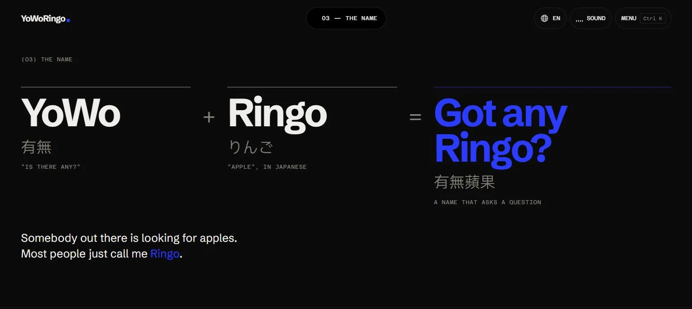
</p>

### 作品列表，预览图跟着你走

作品名称以超大字号逐行排列，鼠标悬停在某一行，整行会被群青蓝点亮，预览卡片则带着一点惯性跟随鼠标移动。

<p align="center">
  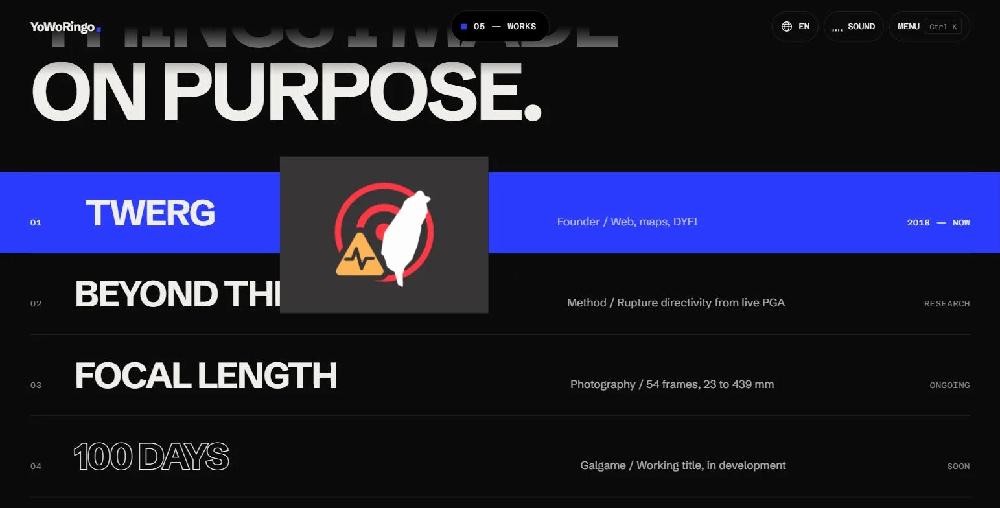
</p>

### 灵动岛与实时生成的音乐

页面顶部的胶囊会提示你当前所在的板块，点一下，它就会“弹”开变成音乐播放器，形态变化使用 CSS `linear()` 编写的弹簧曲线。

背景音乐《Got any Ringo?》以 84 BPM、32 小节循环，由浏览器实时演奏，切换到其他页面时，音乐会从同一位置继续播放，离开前还会先平滑淡出。

### 命令面板

在任意位置按下 <kbd>Ctrl</kbd> + <kbd>K</kbd>，即可直接跳转到任一板块或页面、复制邮箱、开关声音、切换语言，在手机上则会变为全屏面板，另外，还有一些命令并未出现在列表里。

<p align="center">
  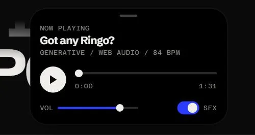
  &nbsp;
  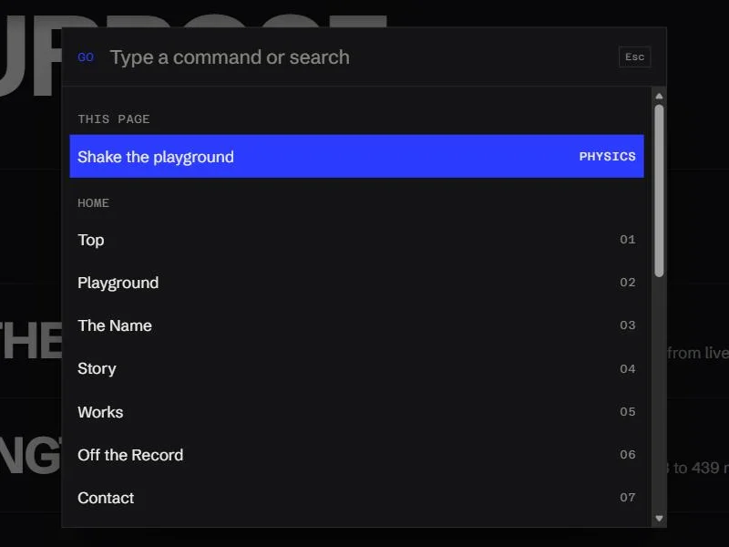
</p>

### 焦段（Focal Length）

54 张街拍作品，按焦段从 23 mm 排列到 439 mm，在这一页，滚动就是变焦环，右侧的镜头刻度尺采用对数刻度，视角越窄，取景框也随之收窄，角落的读数实时显示当前焦段与视角，点开照片，查看器会染上这张照片的主色调，并配上一声快门。

<p align="center">
  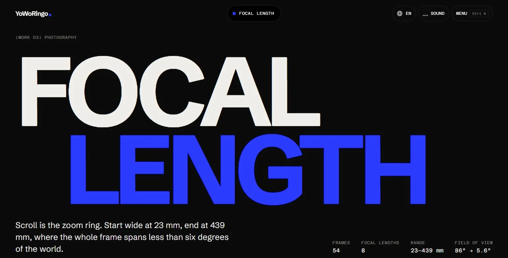
  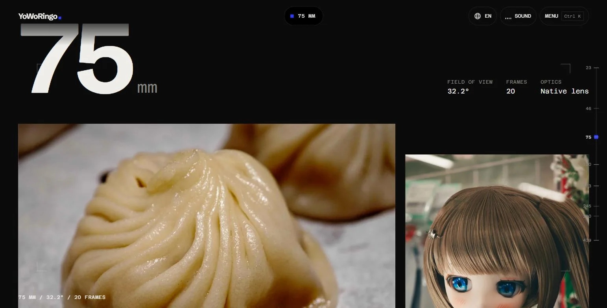
</p>

### 超越点源（Beyond the Point）：地震回放

以交互形式回放三次台湾地震，左右拖动分隔线，即可对比传统的点源估算与考虑破裂方向的估算，拖动时间轴从 T+0 秒到 T+60 秒，S 波波前和关键城市柱状图会同步变化，所有数据均为离线预先计算，页面只展示结果，不包含任何算法。

<p align="center">
  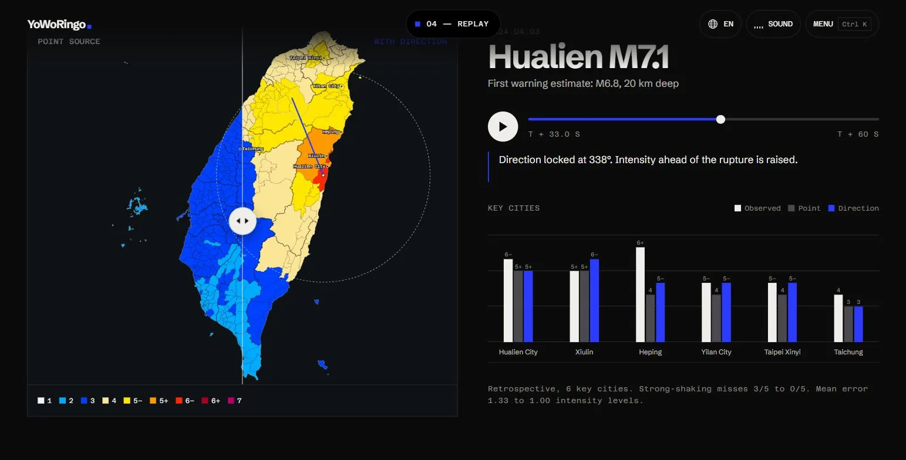
</p>

### 百日（100 Days）

一款开发中、剧情偏暗黑的叙事游戏介绍页，开场画面固定不动，随着滚动，天数从 001 数到 100，下方一百格的进度条也逐格填满。

<p align="center">
  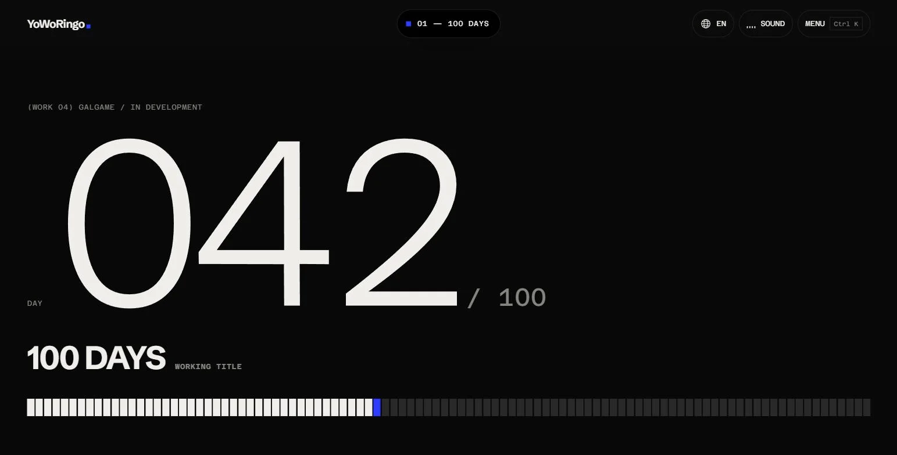
</p>

### 全尺寸屏幕适配

所有动效都针对手机、平板、电脑的屏幕宽度做过设计，部分交互还专门为触屏重做，横向滚动的作品墙在手机上改为手指滑动，命令面板变为全屏，灵动岛则移到屏幕底部。

<p align="center">
  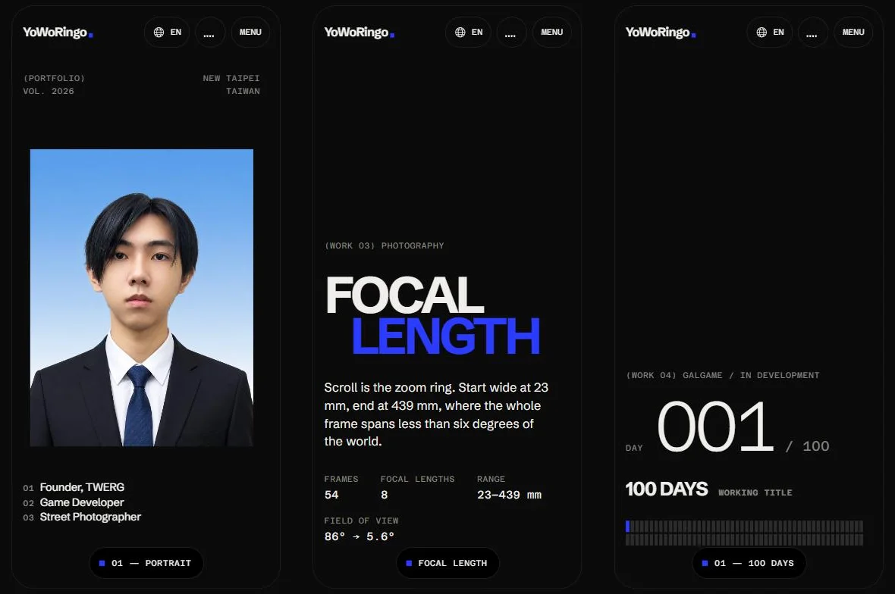
</p>

<br>

## 三种语言，零布局偏移

网站以英文为主，如果浏览器首选中文，会自动切换为繁体或简体中文，右上角的地球按钮可以在 EN、繁、简 之间循环切换。

- **是本地化，不是简繁转换。** 繁体中文按台湾的表达习惯撰写，简体中文则替换为大陆常用说法，比如“视频”“简历”“烈度”，而不只是把字形转成简体。
- **切换时页面纹丝不动。** 繁体和简体使用同一款可变字体、相同的字重范围，因此互相切换时，页面上没有任何一行会移动，你正在读的那一段，切换后依然停在原处。
- **你点下之前，就已经准备好了。** 浏览器空闲时会预先下载下一种语言的词典，鼠标一悬停到按钮上，就开始加载字体，所以点击的那一刻，几乎瞬间完成。
- **字体足够轻量。** HarmonyOS Sans 只保留网站实际用到的字符，并拆分为两个文件，浏览英文页面时，只需加载 9 KB 的中文字形。

<p align="center">
  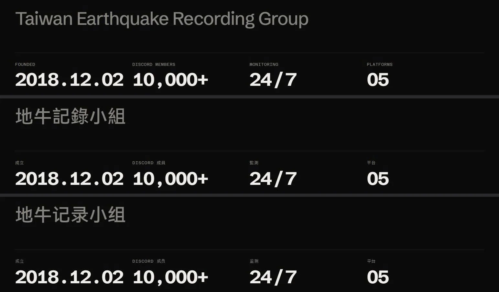
</p>

<br>

## 无障碍

交互再丰富，也不该把任何人挡在门外。

- **全站支持键盘操作。** 包括物理游乐场的作品卡片、灵动岛、播放器、照片查看器，都可以通过 <kbd>Tab</kbd>、<kbd>Enter</kbd>、<kbd>Esc</kbd> 和方向键完成操作。
- **跳到内容。** 在每个页面第一次按下 <kbd>Tab</kbd>，会出现“跳到内容”链接，可直接跳过导航栏。
- **弹窗不会让人迷路。** 命令面板或照片查看器打开时，背后的页面会暂时无法被选中，关闭后，焦点会回到原来的位置。
- **对读屏软件友好。** 图标按钮都有文字标注，装饰性画布会被隐藏，每个板块都有标题，每张照片都有描述，通知会被朗读，页面的语言标识也会随语言切换同步更新。
- **尊重“减弱动态效果”。** 系统开启该设置后，平滑滚动、像素开场、滚动淡入和页面转场都会自动关闭，内容直接呈现。

<p align="center">
  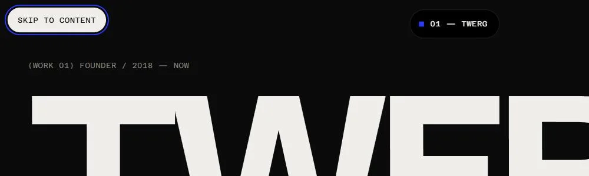
</p>

<br>

## 性能

- 画布动画与物理运算一旦离开可视区域，就会立即暂停。
- 像素密度会根据设备性能自动调整。
- 照片提供 AVIF 与 WebP 两种格式、三种尺寸，附带模糊占位图与主色调，按需加载。
- 演示视频在即将进入可视区域之前不会下载。
- 中文词典与字体均为按需加载。
- 桌面端实测，最大内容绘制约 0.2 秒，累计布局偏移为 0。

<br>

## 技术栈

| | |
|---|---|
| 构建 | [Vite](https://vite.dev)（多页面）、原生 JavaScript，未使用 UI 框架 |
| 动效 | [GSAP](https://gsap.com) 与 ScrollTrigger、[Lenis](https://lenis.darkroom.engineering)、CSS `linear()` 弹簧曲线、View Transitions API |
| 交互 | [Matter.js](https://brm.io/matter-js/)、Canvas 2D、Web Audio API |
| 字体 | [Schibsted Grotesk](https://fonts.google.com/specimen/Schibsted+Grotesk)、[Azeret Mono](https://fonts.google.com/specimen/Azeret+Mono)、华为 HarmonyOS Sans TC / SC |
| 素材处理 | [sharp](https://sharp.pixelplumbing.com)、[subset-font](https://github.com/papandreou/subset-font)、[fontkit](https://github.com/foliojs/fontkit)、[OpenCC](https://github.com/nk2028/opencc-js) |
| 部署 | GitHub Pages，每次推送到 `main` 分支后由 GitHub Actions 自动部署 |

<br>

## 目录结构

```
index.html, photography/, works/{twerg,plum,galgame}/, 404.html   各页面
src/css/        设计 token、基础样式、组件、页面样式
src/js/         入口、全站公共框架、功能模块、页面脚本
src/i18n/       繁体与简体中文词典
src/data/       照片数据与预先计算的回放数据
public/         处理后的图片、字体、视频、图标、分享预览图
scripts/        素材处理脚本（照片、证件照、字体、多语言、品牌）
docs/readme/    本 README 使用的截图
```

## 本地运行

```bash
npm install
npm run dev        # 开发服务器
npm run build      # 构建生产版本到 dist/
npm run preview    # 预览生产版本
```

素材处理命令（`npm run photos`、`portrait`、`works`、`fonts`、`i18n`、`brand`、`readme`）会根据原始文件重新生成 `public/` 中的全部素材，但原始文件（例如原尺寸照片、字体源文件）并未包含在本仓库中，因此克隆后无法直接运行这些命令，处理后的成品则已提交到仓库中。

<br>

## 许可

**保留所有权利。** 本仓库公开仅供阅读与学习，未经许可，不得复制、二次使用、修改、再分发，或将任何部分用于商业用途，范围包括代码、设计、文案、照片、证件照、音乐与标志，完整条款请参阅 [LICENSE](LICENSE)。

第三方库与字体遵循其各自的许可协议。

<br>

<p align="center">
  <sub>Got any Ringo? &nbsp;·&nbsp; <a href="mailto:apple@twerg.org">apple@twerg.org</a> &nbsp;·&nbsp; <a href="https://www.instagram.com/yowoapple/">Instagram</a> &nbsp;·&nbsp; <a href="https://x.com/AppleJackOAO">X</a></sub>
</p>
